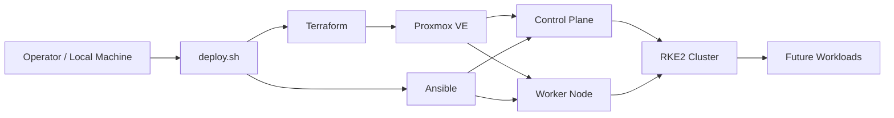

# Raven DFIR Platform

 El propósito de este proyecto es desplegar automáticamente una plataforma Kubernetes basada en <strong>RKE2</strong> sobre <strong>Proxmox</strong>, utilizando <strong>Terraform</strong> para el aprovisionamiento de la infraestructura y <strong>Ansible</strong> para la configuración de los nodos. 

 Este proyecto representa la base sobre la que se construirán futuras capacidades de DFIR, Incident Response e IA utilizando modelos locales. 

<h1>Arquitectura</h1>

<h1>Features</h1>

<ul> 
    <li>Infraestructura como código con Terraform</li>
    <li>Aprovisionamiento automático de máquinas virtuales en Proxmox</li>
    <li>Configuración automatizada mediante Ansible</li>
    <li>Despliegue automático de un clúster Kubernetes basado en RKE2</li>
    <li>Workflow de deployment completamente reproducible</li> 
</ul>

<h1>Requisitos</h1>

Para poder ejecutar este proyecto se necesitan cumplir los siguientes requerimientos antes de comenzar:

<ul> 
    <li>Proxmox VE</li>
    <li>Terraform instalado</li>
    <li>Ansible instalado</li>
    <li>KeepassXC (opcional)</li>
    <li>Template de Ubuntu Server con Cloud-Init configurado en Proxmox</li>
</ul>

<h1>Aclaración</h1>

En mi caso, quise utilizar un gestor de contraseñas para guardar las mismas allí,utilizar el script para obtener sus respectivos valores y crearlas como variables de entorno como medida de seguridad por diseño, podes bypassear el gestor de contraseñas y definir las variables de entorno manualmente.

<h1>Uso</h1>

Para poder ejecutar correctamente este script seguir estos pasos:

<ul>
    <li>Clonar o descargar repositorio</li>
    <li>Si utilizas KeepassXC</li>
    <ul>
        <li>En el archivo <strong>getEnv.sh</strong> setear la ruta correspondiente al archivo kdbx que contiene los datos sensibles,además de corregir las rutas de los secretos</li>
        <li>En el archivo <strong>deploy.sh</strong> definir el path de la variable <strong>DB</strong>, donde se aloja el proyecto</li>
    </ul>
    <li>En el archivo <strong>main.tf</strong> dentro de la carpeta <strong>terraform</strong>, cambiar el valor de la variable <strong>pm_api_url</strong></li>
    <li>En el archivo <strong>kubernetes</strong> dentro de la carpeta <strong>terraform</strong>, cambiar los valores de las variables</li>
    <ul>
        <li>valor de clone al id de la vm a clonar</li>
        <li>valor de target_node al nombre del nodo de proxmox</li>
        <li>valor de ipconfig0 a la ip que desees, valor de gateway y de nameserver</li>
        <li>valor de storage en cloudinit donde se encuentre el disco de cloudinit</li>
        <li>valor de storage en scsi0 donde se alojará el disco de la vm</li>
        <li>valor de size en scsi0 donde se especifica el tamaño del disco de la vm</li>
    </ul>
    <li>En el archivo <strong>inventory.ini</strong> modificar los siguientes valores</li>
    <ul>
        <li>Valor de ansible_host a la ip definida en <strong>ipconfig0</strong></li>
        <li>Valor de ansible_user al usuario definido dentro de ciuser</li>
        <li>Valor de ansible_ssh_private_key_file a la llave privada correspondiente a la llave pública cargada a la maquina</li>
    </ul>
    <li> Una vez realizados los cambios en los archivos, correr el script utilizando <strong>./deploy.sh</strong>
</ul>

<h1>Próximos pasos</h1>

El proyecto se encuentra en una primera etapa centrada en la automatización de la infraestructura. Los siguientes pasos serán:

<ul> 
    <li>Despliegue automático de Ollama sobre Kubernetes.</li>
    <li>Incorporación de almacenamiento persistente para los modelos.</li> 
    <li>Despliegue automático de Ingress y certificados TLS.</li> 
    <li>Automatización del despliegue de Rancher para la administración del clúster.</li> 
    <li>Primeros agentes orientados a DFIR e Incident Response ejecutándose sobre modelos locales.</li>
    <li>Documentación de la arquitectura y de los componentes desplegados.</li> 
</ul>
